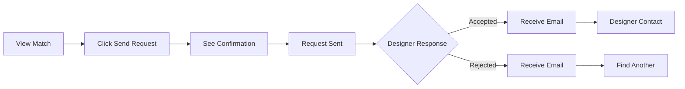
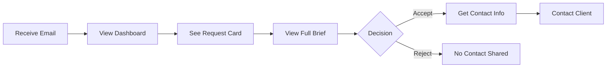

# 🎯 Working Request System Documentation

## Overview

The Working Request System is a streamlined one-click solution for clients to contact designers, replacing the previous complex messaging system. This document covers the complete implementation, testing, and deployment of this feature.

**Version**: 2.2.0  
**Release Date**: August 18, 2025  
**Status**: Production Ready (pending database migration)

## Table of Contents

1. [System Architecture](#system-architecture)
2. [User Flow](#user-flow)
3. [Technical Implementation](#technical-implementation)
4. [Database Schema](#database-schema)
5. [API Endpoints](#api-endpoints)
6. [Component Structure](#component-structure)
7. [Testing & Monitoring](#testing--monitoring)
8. [Deployment Guide](#deployment-guide)
9. [Troubleshooting](#troubleshooting)

## System Architecture

### Core Principles

1. **One-Click Simplicity**: No message composition required
2. **Single Source of Truth**: Brief snapshot preserves exact submission state
3. **Time-Bounded**: 72-hour response deadline creates urgency
4. **Professional Communication**: Auto-generated messages maintain quality
5. **Centralized Architecture**: Uses all 8 phases of the centralization system

### Key Features

- ✅ One-click "Send Working Request" button
- ✅ Auto-generated professional messages
- ✅ Brief snapshot preservation (JSONB)
- ✅ 72-hour countdown timer
- ✅ View tracking (NEW badge)
- ✅ Email notifications (Marc Lou style)
- ✅ Accept/Reject workflow
- ✅ Contact detail protection

## User Flow

### Client Journey



1. Client views unlocked designer match
2. Clicks "Send Working Request" button
3. Sees instant confirmation modal
4. Request automatically sent with professional message
5. Waits for designer response
6. Receives email notification of outcome

### Designer Journey



1. Designer receives email notification
2. Views request in dashboard with countdown
3. Clicks "View Full Brief" for details
4. Makes accept/reject decision
5. If accepted: sees client email
6. If rejected: no contact details shared

## Technical Implementation

### File Structure

```
/src/
├── components/
│   ├── modals/
│   │   └── WorkingRequestModal.tsx      # Confirmation UI
│   ├── match/
│   │   └── EnhancedMatchCard.tsx        # Updated with new flow
│   └── designer/
│       ├── WorkingRequestCard.tsx       # Dashboard card
│       └── BriefViewerModal.tsx         # Full brief viewer
├── app/
│   └── api/
│       ├── client/matches/[id]/
│       │   └── contact/route.ts         # Create request
│       └── designer/project-requests/
│           ├── [id]/view/route.ts       # Mark as viewed
│           └── [id]/respond/route.ts    # Handle response
├── lib/
│   ├── database/
│   │   └── project-request-service.ts   # Centralized DB ops
│   └── email/templates/
│       └── project-request.ts           # Email templates
└── test/
    ├── test-working-request-flow.js     # E2E testing
    ├── cleanup-test-requests.js         # Data cleanup
    └── working-request-status.js        # Status monitor
```

### Component Details

#### WorkingRequestModal
- **Purpose**: Simple confirmation dialog
- **Features**: No text input, auto-success animation
- **Props**: `isOpen`, `onClose`, `onConfirm`, `designerName`, `projectType`

#### WorkingRequestCard
- **Purpose**: Display request in designer dashboard
- **Features**: Status badges, countdown timer, brief preview
- **States**: Pending (with actions), Approved (show email), Rejected

#### BriefViewerModal
- **Purpose**: Full brief display for designers
- **Features**: All brief fields, countdown, accept/reject buttons
- **Data Source**: `brief_snapshot` from database

### Service Layer

#### ProjectRequestService (`/src/lib/database/project-request-service.ts`)
```typescript
interface ProjectRequestService {
  create(data: CreateRequestData): Promise<ProjectRequest>
  getByDesigner(designerId: string): Promise<ProjectRequest[]>
  getById(id: string, designerId: string): Promise<ProjectRequest>
  approve(id: string, designerId: string): Promise<boolean>
  reject(id: string, designerId: string, reason?: string): Promise<boolean>
  checkExisting(matchId: string, designerId: string): Promise<boolean>
}
```

## Database Schema

### Migration Required

```sql
-- Add columns to project_requests table
ALTER TABLE public.project_requests 
  ADD COLUMN IF NOT EXISTS viewed_at TIMESTAMP WITH TIME ZONE,
  ADD COLUMN IF NOT EXISTS response_deadline TIMESTAMP WITH TIME ZONE,
  ADD COLUMN IF NOT EXISTS brief_snapshot JSONB;

-- Performance indexes
CREATE INDEX IF NOT EXISTS idx_project_requests_deadline 
  ON public.project_requests(response_deadline) 
  WHERE status = 'pending';

CREATE INDEX IF NOT EXISTS idx_project_requests_viewed 
  ON public.project_requests(viewed_at) 
  WHERE viewed_at IS NOT NULL;

-- Auto-deadline trigger
CREATE OR REPLACE FUNCTION set_response_deadline()
RETURNS TRIGGER AS $$
BEGIN
  IF NEW.response_deadline IS NULL THEN
    NEW.response_deadline := NEW.created_at + INTERVAL '72 hours';
  END IF;
  RETURN NEW;
END;
$$ LANGUAGE plpgsql;
```

### Brief Snapshot Structure

```json
{
  "project_type": "Logo Design",
  "timeline": "1-2 weeks",
  "budget": "$1,000-$5,000",
  "industry": "Technology",
  "project_description": "...",
  "target_audience": "...",
  "project_goal": "...",
  "styles": ["modern", "minimal"],
  "match_score": 78,
  "match_reasons": ["Style alignment", "Budget match"]
}
```

## API Endpoints

### POST `/api/client/matches/[id]/contact`
Creates working request with auto-generated message and brief snapshot.

**Request Body**: Empty (one-click)

**Response**:
```json
{
  "success": true,
  "message": "Request sent successfully",
  "requestId": "uuid"
}
```

### GET `/api/designer/project-requests/[id]/view`
Marks request as viewed and returns brief data.

**Response**:
```json
{
  "success": true,
  "brief": { /* brief_snapshot data */ },
  "viewedAt": "2025-08-18T10:00:00Z"
}
```

### POST `/api/designer/project-requests/[id]/respond`
Handles designer accept/reject decision.

**Request Body**:
```json
{
  "action": "approve" | "reject",
  "rejectionReason": "optional reason"
}
```

## Testing & Monitoring

### Test Scripts

1. **End-to-End Test** (`test-working-request-flow.js`)
   ```bash
   SUPABASE_SERVICE_ROLE_KEY="..." node test/test-working-request-flow.js
   ```

2. **Status Dashboard** (`working-request-status.js`)
   ```bash
   SUPABASE_SERVICE_ROLE_KEY="..." node test/working-request-status.js
   ```
   
   Features:
   - Migration status check
   - Request statistics with progress bars
   - Active match tracking
   - Recent activity log
   - System health indicators

3. **Cleanup Utility** (`cleanup-test-requests.js`)
   ```bash
   # Preview test requests
   node test/cleanup-test-requests.js
   
   # Delete test requests
   node test/cleanup-test-requests.js --confirm
   ```

### Monitoring Dashboard Output

```
╔════════════════════════════════════════════════╗
║     🎯 WORKING REQUEST SYSTEM STATUS BOARD     ║
╚════════════════════════════════════════════════╝

📦 DATABASE MIGRATION STATUS
──────────────────────────────────────────────────
✅ All required columns present
   • viewed_at: EXISTS
   • response_deadline: EXISTS
   • brief_snapshot: EXISTS

📊 REQUEST STATISTICS
──────────────────────────────────────────────────
Total Requests: 42
⏳ Pending:  ████████░░░░░░░░░░░░ 17/42
✅ Approved: ████████████░░░░░░░░ 20/42
❌ Rejected: ███░░░░░░░░░░░░░░░░░ 5/42

👁️ View Rate: 82% of pending requests have been viewed

🎉 SYSTEM FULLY OPERATIONAL
```

## Deployment Guide

### Prerequisites

1. Database migration applied (see Database Schema section)
2. Environment variables configured
3. Git repository access

### Deployment Steps

```bash
# 1. Commit changes
git add -A
git commit -m "feat: Working Request System implementation"

# 2. Push to GitHub
git push origin main

# 3. Deploy to Vercel
vercel --prod

# 4. Verify deployment
node test/working-request-status.js
```

### Environment Variables Required

```env
NEXT_PUBLIC_APP_URL=https://onedesigner.app
SUPABASE_SERVICE_ROLE_KEY=...
RESEND_API_KEY=...
USE_NEW_DATA_SERVICE=true
USE_ERROR_MANAGER=true
USE_REQUEST_PIPELINE=true
USE_CONFIG_MANAGER=true
USE_BUSINESS_RULES=true
USE_CENTRALIZED_LOGGING=true
USE_OTP_SERVICE=true
USE_EMAIL_SERVICE=true
```

## Troubleshooting

### Common Issues

#### Migration Not Applied
**Symptom**: "Migration not applied" in status dashboard  
**Solution**: Run migration SQL in Supabase dashboard

#### Requests Not Appearing
**Symptom**: Sent requests don't show in designer dashboard  
**Cause**: Migration incomplete or API error  
**Solution**: Check migration status and API logs

#### Email Not Sending
**Symptom**: No email notifications received  
**Cause**: Rate limiting or Resend API issue  
**Solution**: Check email queue status and Resend dashboard

#### Countdown Timer Not Working
**Symptom**: Timer shows incorrect time or doesn't update  
**Cause**: `response_deadline` not set  
**Solution**: Verify trigger is created in database

### Debug Commands

```bash
# Check migration status
node scripts/check-and-apply-migration.js

# Test complete flow
node test/test-working-request-flow.js

# Monitor system health
node test/working-request-status.js --watch

# Check specific request
SUPABASE_SERVICE_ROLE_KEY="..." node -e "
const { createClient } = require('@supabase/supabase-js');
const supabase = createClient('https://frwchtwxpnrlpzksupgm.supabase.co', process.env.SUPABASE_SERVICE_ROLE_KEY);
supabase.from('project_requests').select('*').eq('id', 'REQUEST_ID').single().then(console.log);
"
```

## Performance Considerations

- **Indexes**: Deadline and viewed_at indexes for fast queries
- **Brief Snapshot**: JSONB storage for efficient querying
- **Auto-trigger**: Database-level deadline setting
- **Component Caching**: React memo for expensive renders
- **Email Queue**: Rate-limited to prevent overload

## Security

- **Contact Protection**: Email only revealed after acceptance
- **Session Validation**: All APIs check designer/client auth
- **Rate Limiting**: OTP and email services protected
- **Data Integrity**: Brief snapshot preserves original state

## Future Enhancements

1. **Analytics Dashboard**: Track acceptance rates, response times
2. **Smart Matching**: ML-based designer suggestions
3. **Template Messages**: Customizable auto-generated messages
4. **Mobile App**: Native mobile experience
5. **Video Briefs**: Support for video project descriptions

## Support

For issues or questions:
- GitHub Issues: https://github.com/ruzmaco/onedesigner/issues
- Documentation: `/docs/WORKING_REQUEST_SYSTEM.md`
- Test Scripts: `/test/` directory
- Migration Guide: `/scripts/apply-working-request-migration-manual.md`

---

**Created by**: OneDesigner Development Team  
**Last Updated**: August 18, 2025  
**Version**: 2.2.0